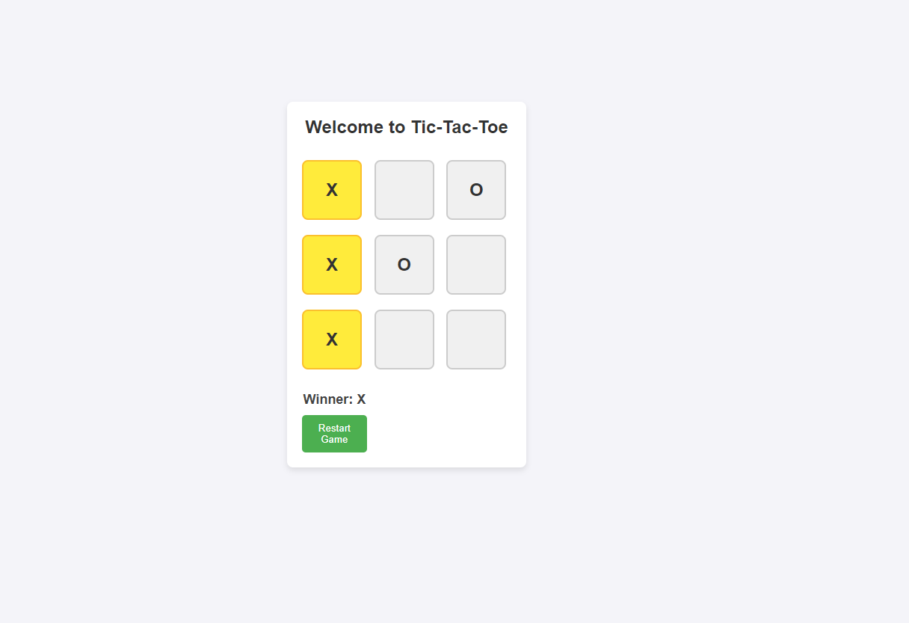

# Tic-Tac-Toe Game

This is a simple **Tic-Tac-Toe** game built using **React**. The game allows two players to play on a 3x3 grid, with one player using 'X' and the other using 'O'. It includes features like detecting the winner, highlighting winning squares, and displaying winner message.

## Features

- **Two-player functionality**: Players take turns to place their mark ('X' or 'O') on the grid.
- **Winner detection**: The game automatically detects and highlights the winning combination (horizontal, vertical, or diagonal).
- **Restart functionality**: After a game finishes, the players can restart the game.

## Screenshots

